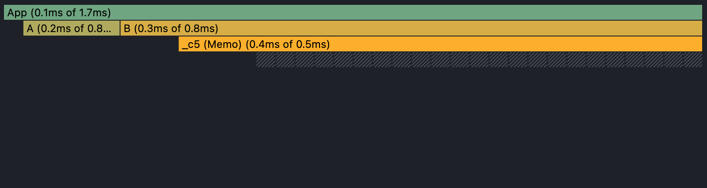
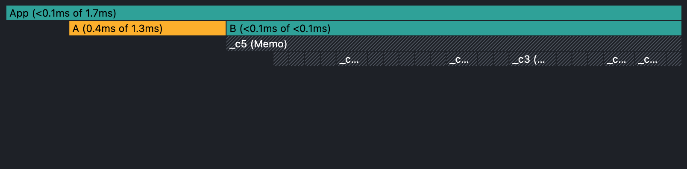

# react-performance-optimization

compare performance optimizations in React components

👇 **default components**

👇 **compare performance in using React.memo**
- before use React.memo

- after use React.memo

👇 **compare performance in using useCallback**
- before use useCallback

- after use useCallback

